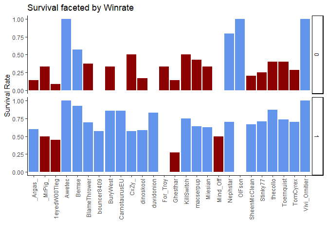
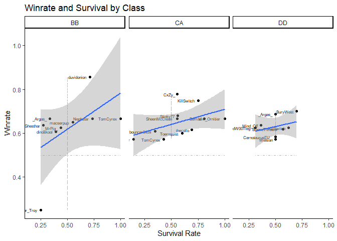

### Background

With the data currently available, it is difficult to directly infer or
correlate player performance with game outcomes. There is a near total
absence of individual performance statistics, and there are a huge
number of slightly awkward variables which change from session to
session which make it difficult to attribute successes or failures to
individuals or individual changes. Even when changes are evident
(different class or ship, e.g) the sample size for that change can be
ridiculously small, or it can be accompanied by so many other team-wide
changes that it could easily be noise rather than cause.

Alongside winrate, which is team-wide so less easily attributed
individually, I have survival as a genuine individual performance
metric. So, the question arises: can I draw some kind of conclusion
about player performance or game impact based on the game outcome and
the player’s survival? Are there some players who consistently die,
consistently die when we win, or consistently survive when we lose? If
not individual players, can anything be inferred from whether specific
classes or specific ships consistently survive or die in wins/losses?

Obviously, there should be a correlation between players surviving and
winning, since everyone dying is a loss condition, but I don’t know how
strong that correlation will be, or whether it does/does not exist with
regards to specific individuals as well as team aggregates.

The first thing to look at is, quite simply, survival rates versus
winrates:

``` r
playerRates <- players %>% group_by(Name) %>% summarise(SurRate = mean(as.numeric(Survived)),WinRate=mean(Result))

playerRates %>%
  ggplot(aes(x=SurRate,y=WinRate,label=Name))+
  scale_color_manual(values=c("TRUE"="cornflowerblue","FALSE"="darkred"))+
  geom_point(aes(colour=SurRate>0.5))+
  geom_text(hjust=1.2,size=2)+
  geom_line(linetype="dotdash",aes(y=0.5, colour="lightgrey",alpha=0.5))+
  theme_classic()+
  guides(color=guide_legend(title=""))+
  ggtitle("WR vs Sur")+
  ylab("Winrate")+
  xlab("Survival Rate")+
  geom_smooth(method='lm', formula= y~x)+
  theme(legend.position = "none")
```

<!-- -->

This isn’t bad, actually: there is a non-zero visible correlation
between winrate and individual survival rate, but it is not especially
strong. This will also somewhat fail to catch weirdo outliers - those
with especially few or many games.

I do need to survive better, though, but I get sloppy when games are
won.. and probably when they aren’t.

So. Followons: Survival faceted by win/loss and by ship class.

``` r
playerRates <- players %>% group_by(Name,Result) %>% summarise(SurRate = mean(as.numeric(Survived)),.groups = 'drop')

playerRates %>%
  ggplot(aes(x=Name,y=SurRate,fill=SurRate>0.5,label=Name))+
  scale_fill_manual(values=c("TRUE"="cornflowerblue","FALSE"="darkred"))+
  geom_col()+
  theme_classic()+
  theme(axis.text.x = element_text(angle = 90, vjust = 0.5, hjust=1))+
  guides(color=guide_legend(title=""))+
  ggtitle("WR vs Sur")+
  ylab("Survival Rate")+
  xlab("")+
  theme(legend.position = "none")+
  facet_grid(vars(Result))
```

<!-- -->

So, there is obviously going to be a correlation between winning and
surviving - even absolute sausages like me survive far more when they
win. Some weirdos: Awetec, Bemse, Nephstar, OIFson, Vivi\_Ornitier all
have &gt;50% survival when losing, with some VERY high - Bemse is
probably within a ‘normal’ range of surviving just slightly over 50%
instead of slightly under. With the exception of OIFson, everyone with a
poor survival rate while winning has a *better* survival rate while
winning than while losing.

So: a few of these are probably very low sample sizes. Easy to check:

``` r
players %>% filter(Name %in% c("OlFson","Bemse","Awetec","Nephstar","Vivi_Ornitier")) %>% group_by(Name,Result) %>% summarise(SurRate = mean(as.numeric(Survived)), N=n(),.groups = 'drop')
```

    ## # A tibble: 10 x 4
    ##    Name          Result SurRate     N
    ##    <chr>          <dbl>   <dbl> <int>
    ##  1 Awetec             0   1         1
    ##  2 Awetec             1   1         1
    ##  3 Bemse              0   0.571     7
    ##  4 Bemse              1   0.929    14
    ##  5 Nephstar           0   0.8       5
    ##  6 Nephstar           1   0.7      10
    ##  7 OlFson             0   1         1
    ##  8 OlFson             1   0         1
    ##  9 Vivi_Ornitier      0   1         2
    ## 10 Vivi_Ornitier      1   1         4

So: Awetec and OlFson are just sample size issues. Bemse survives A LOT,
which could mean he is very good, or could be a bit overpassive. Ditto
Nephstar. Vivi is low sample, again, and 100% survival rates. Maybe
there is something to do with the ships people are playing, maybe there
is nothing to see here.

Bemse, Nephstar, and Vivi - ship classes:

``` r
players %>% filter(Name %in% c("Bemse","Nephstar","Vivi_Ornitier")) %>% group_by(Name,Result,Class) %>% summarise(SurRate = mean(as.numeric(Survived)), N=n(),.groups = 'drop')
```

    ## # A tibble: 6 x 5
    ##   Name          Result Class SurRate     N
    ##   <chr>          <dbl> <chr>   <dbl> <int>
    ## 1 Bemse              0 CA      0.571     7
    ## 2 Bemse              1 CA      0.929    14
    ## 3 Nephstar           0 BB      0.8       5
    ## 4 Nephstar           1 BB      0.7      10
    ## 5 Vivi_Ornitier      0 CA      1         2
    ## 6 Vivi_Ornitier      1 CA      1         4

I would have expected both BBs and CAs to die quite often when we lose
games: losing with ships alive - especially beefy ones - implies
passivity.

``` r
players %>% filter(Name %in% c("Bemse","Nephstar","Vivi_Ornitier")) %>% group_by(Name,Result,Ship) %>% summarise(SurRate = mean(as.numeric(Survived)), N=n(),.groups = 'drop')
```

    ## # A tibble: 9 x 5
    ##   Name          Result Ship    SurRate     N
    ##   <chr>          <dbl> <chr>     <dbl> <int>
    ## 1 Bemse              0 Moskva    0.667     3
    ## 2 Bemse              0 Venezia   0.5       4
    ## 3 Bemse              1 Moskva    0.833     6
    ## 4 Bemse              1 Venezia   1         8
    ## 5 Nephstar           0 Ohio      0.8       5
    ## 6 Nephstar           1 Kremlin   0.667     3
    ## 7 Nephstar           1 Ohio      0.714     7
    ## 8 Vivi_Ornitier      0 Venezia   1         2
    ## 9 Vivi_Ornitier      1 Venezia   1         4

No firm conclusions, but it is interesting at least.

So, backing out to everyone again: is there a survival difference when
splitting by ship classes?

``` r
playerRates <- players %>% group_by(Name,Class) %>% summarise(SurRate = mean(as.numeric(Survived)),WinRate=mean(Result),N=n(),.groups="drop") %>% filter(N>2)

playerRates %>%
  ggplot(aes(x=SurRate,y=WinRate,label=Name))+
  scale_color_manual(values=c("TRUE"="cornflowerblue","FALSE"="darkred"))+
  geom_point()+
  geom_text(hjust=1.2,size=2)+
  geom_line(linetype="dotdash",aes(y=0.5, colour="lightgrey",alpha=0.5))+
  theme_classic()+
  guides(color=guide_legend(title=""))+
  ggtitle("WR vs Sur")+
  ylab("Winrate")+
  xlab("Survival Rate")+
  theme(legend.position = "none")+
  geom_smooth(method='lm', formula= y~x)+
  facet_wrap(vars(Class))
```

<!-- -->

If I filter out people with fewer than 2 games (a low bar, but here we
are) then we see a relatively weak but consistent positive correlation
between survival rate and winrate. The correlation is weakest with DDs,
which both makes perfect sense and is relatively counterintuitive: the
highest risk-reward class is definitely more valuable as the game goes
on, but if they aren’t doing anything, they aren’t creating any value,
so playing ‘too safe’ is as bad as being ‘too aggressive’ - it is about
generating value not surviving per se.

So: I need to consider my survival more, regardless.
